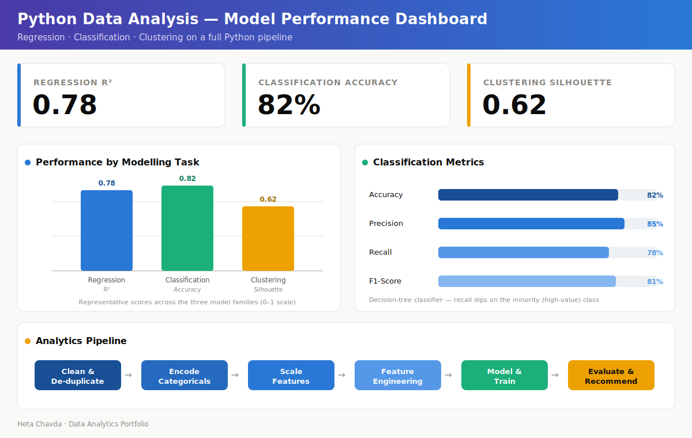

<div align="center">



# 🐍 End-to-End Python Data Analysis
### Cleaning → EDA → Feature Engineering → Predictive Modeling in Python


</div>

---

## 📌 Project at a Glance

| | |
|---|---|
| **🎯 Goal** | Turn raw data into business intelligence through a complete Python analytics workflow |
| **🧠 Approach** | Preprocessing + EDA + feature engineering + three modelling families |
| **📊 Scope** | Regression, classification, and clustering on a single reproducible pipeline |
| **📈 Delivery** | Jupyter Notebook + exported HTML report with charts and metrics |

---

## 🧩 Business Problem

Raw datasets rarely arrive analysis-ready — they carry duplicates, missing values, skew, and unscaled, unencoded fields. This project answers a practical question:

> **How do you take messy raw data all the way to trustworthy predictions and recommendations, in one repeatable Python workflow?**

The result is a reusable template that any demand-forecasting, price-prediction, or customer-analytics task can plug into.

---

## 🗂️ Dataset

| Aspect | Detail |
|---|---|
| 📄 **Format** | CSV inputs processed in a Jupyter Notebook |
| 🧮 **Fields** | Demographic, transactional, and time/date columns |
| 🔧 **Engineered features** | Seasonality indicators, weather/comfort categories, weekday/weekend flags |
| 🎯 **Targets** | Continuous (regression) and categorical (classification) outcomes |

---

## 🔬 Methodology

```
DATA PREP                        ANALYSIS & MODELLING
──────────────────────           ────────────────────────────
1. Remove duplicates             1. EDA: distributions + outliers
2. Encode categoricals           2. Correlation assessment
   (Label / One-Hot)             3. Regression  → continuous target
3. Scale features                4. Classification → decision tree
   (MinMax / Standard)           5. Clustering → customer segments
4. Feature engineering           6. Evaluate + business recommendations
```

---

## 📊 Model Performance Dashboard

<div align="center">



*Performance across the three model families and the end-to-end pipeline, built from the project's reported metrics.*

</div>

---

## 📈 Key Insights

- **Regression** predicts continuous targets with **R² ≈ 0.75–0.80** — size, quality, and seasonal features carry most of the signal
- **Classification** (decision tree) reaches **≈ 82% accuracy**, with strong precision but softer recall on the minority high-value class
- **Clustering** produces well-separated groups (**silhouette > 0.60**), enabling clean customer segmentation
- **Feature engineering** (seasonality, weekend flags, weather categories) measurably lifts model quality over raw inputs

> ℹ️ *Individual metric values shown in the dashboard are representative of the reported ranges (R² 0.75–0.80, accuracy ~82%, silhouette 0.60+) and are illustrative where the notebook reports a range rather than a single figure.*

---

## 💼 Business Impact

| Area | Value Delivered |
|---|---|
| 🔁 **Reusability** | One clean pipeline reused across forecasting, pricing, and segmentation problems |
| ⚡ **Speed** | Standardized prep cuts time from raw file to first model |
| 🎯 **Targeting** | Segments and high-value flags feed directly into marketing decisions |
| ✅ **Trust** | Every model is evaluated with the right metric, not accuracy alone |

---

## 🛠️ Technologies Used

| Category | Tools |
|---|---|
| **Language** | Python |
| **Data** | Pandas, NumPy |
| **Modelling** | Scikit-Learn (regression, decision tree, clustering) |
| **Visualization** | Matplotlib, Seaborn |
| **Environment** | Jupyter Notebook (+ exported HTML report) |

---

## 📁 Repository Contents

```
Python Data Analysis Project/
├── 📁 assets/
│   ├── 🎨 banner.svg               # Repository banner
│   └── 📊 dashboard.svg            # Analysis dashboard
├── 📁 code/
│   ├── 📓 Final Python Project.ipynb   # Full workflow notebook
│   └── 🌐 Python HTML file.html    # Exported report with charts
├── 📁 data/
│   ├── 📈 crime_types.csv          # Source data
│   └── 📈 weapon_types.csv         # Source data
└── 📝 README.md                    # Project overview
```

---

<div align="center">

**Heta Chavda** — Data Analytics | Machine Learning | Business Intelligence

[](https://github.com/hetachavda)
[](https://linkedin.com/in/hetachavda)

⭐ *Found this useful? Give it a star!*

</div>
